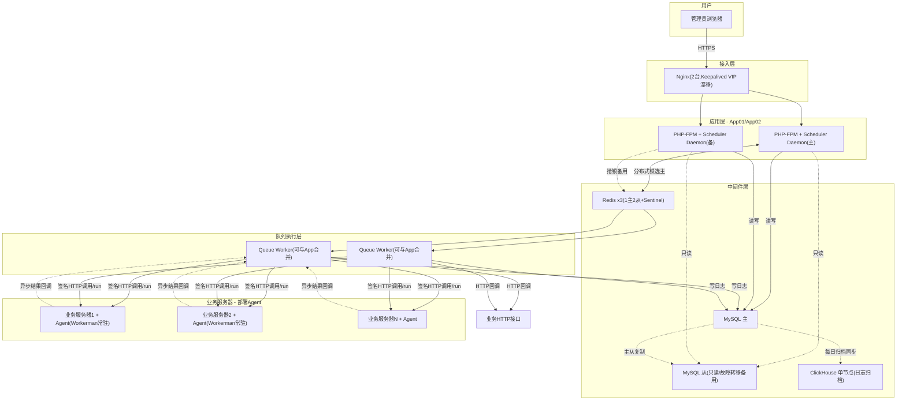
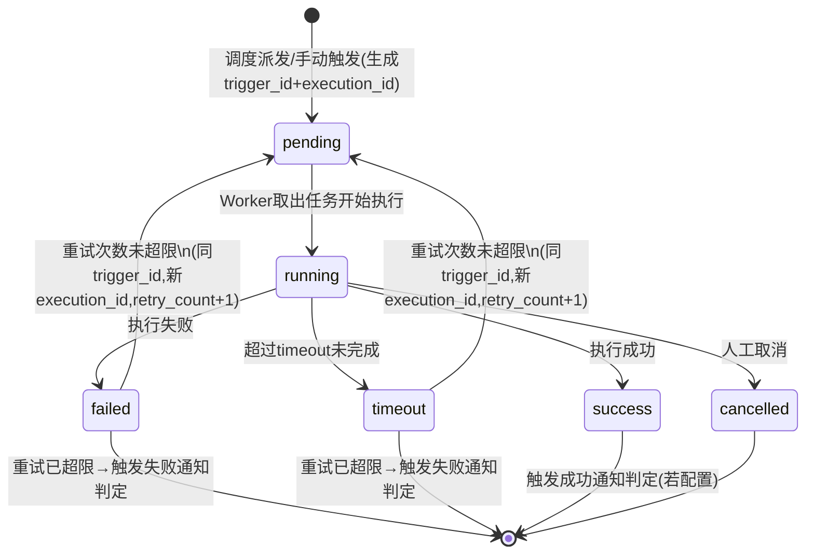
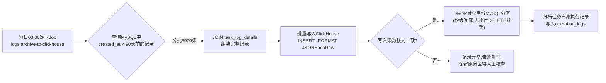
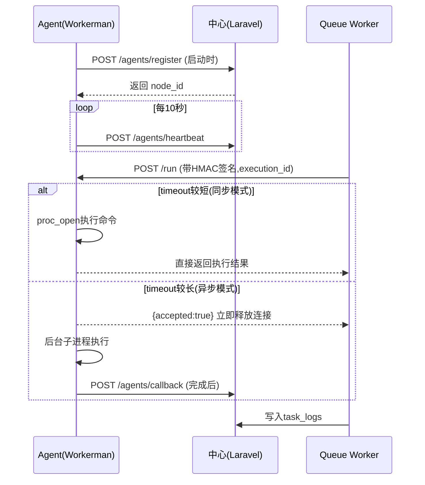

# 定时任务调度管理系统 — 详细设计文档

| 文档信息 | 内容 |
|---|---|
| 版本 | V1.0（详细设计） |
| 基于 | 《定时任务调度管理系统-概要设计文档》V1.0 |
| 部署规模 | 小型（任务数 < 1000，单机房，预算有限） |
| 本次确认的关键约束 | 需要Shell执行器；需要日志分表/ClickHouse归档；不做SaaS化；告警暂仅邮件；操作日志+执行日志均需记录 |

---

## 0. 文档说明

本文档是对概要设计的细化落地，重点解决概要设计第17节"风险与待确认事项"中已明确的方向。与概要设计相比，本次范围调整：

| 概要设计的开放项 | 本次确认结果 | 设计调整 |
|---|---|---|
| Shell执行器是否需要 | **需要** | 第4章给出完整Agent协议、安全模型 |
| 部署规模 | **小型，单机房，预算有限** | 第2章硬件清单收紧，HA策略调整为"机房内不单点"而非跨机房容灾 |
| 是否SaaS化 | **不需要** | `projects`保持普通业务分组，不做租户级Schema隔离 |
| 告警渠道 | **暂仅邮件** | 第9章仅实现Email Handler，其余渠道接口占位 |
| 日志归档 | **需要分表+ClickHouse** | 第3.3节给出完整迁移方案（尽管是小型部署，仍按此规划，为后续增长预留） |

---

## 1. 总体部署架构详细设计

### 1.1 详细拓扑图



### 1.2 服务器清单（小型部署，最终版）

| 角色 | 配置 | 数量 | 说明 |
|---|---|---|---|
| Nginx + Keepalived | 2核4G，50G SSD | 2台 | VIP漂移，互为主备 |
| 应用服务器（PHP-FPM + Scheduler Daemon） | 4核8G，100G SSD | 2台 | Scheduler主备选举跑在这两台上 |
| Queue Worker | 4核8G，100G SSD | 2台 | **预算紧张时可直接与应用服务器合并，共4台变2台** |
| MySQL | 8核16G，500G SSD云盘 | 1主1从 | 从库只读+故障转移备用，小规模暂不引入ProxySQL，故障时手动/脚本切换 |
| Redis | 4核8G，50G SSD | 3台 | 1主2从，3台同时兼任Sentinel进程，不单独开机器 |
| ClickHouse（日志归档） | 4核8G，1TB（SATA SSD即可，冷数据查询频率低） | 1台 | 单节点起步，分区/TTL设计预留集群扩展空间 |
| Shell Agent | 无需独立服务器 | 按需安装到目标业务机器 | Workerman常驻进程，内存占用约30-50MB |

**最小化成本方案**：应用服务器与Worker合并 + Redis三节点复用为Sentinel，整套核心基础设施可压缩到 **2台应用/Worker + 2台MySQL + 3台Redis + 1台ClickHouse + 2台Nginx = 10台**，进一步压缩可以把Nginx也用云负载均衡SLB代替（省2台），降到约8台。

### 1.3 小机房HA取舍说明

| 维度 | 选择 | 理由 |
|---|---|---|
| 跨机房容灾 | **不做** | 单机房场景下投入产出比低，预算优先保证机房内不单点 |
| MySQL高可用 | 主从复制 + 监控脚本告警，**不上MGR/ProxySQL** | 小规模下MGR运维复杂度高，先用简单方案，监控到主库异常后人工/半自动切换从库 |
| Redis高可用 | Sentinel（3节点） | 标准最小高可用配置，自动故障转移 |
| Scheduler高可用 | 分布式锁选主（已在概要设计中设计，本次不变） | 与硬件规模无关，2实例即可 |
| 应用层高可用 | 2节点 + Nginx健康检查剔除 | 满足"单节点宕机不影响服务"的基本要求 |

---

## 2. 数据库详细设计

### 2.1 完整表清单

| 表名 | 用途 | 备注 |
|---|---|---|
| `users` | 用户 | |
| `roles` / `permissions` / `model_has_roles` / `model_has_permissions` / `role_has_permissions` | RBAC | 直接使用 `spatie/laravel-permission` 默认迁移文件 |
| `projects` | 项目/业务线分组 | |
| `project_user` | 项目成员与角色 | 用于项目级数据隔离（非SaaS租户隔离，仅业务可见性控制） |
| `tasks` | 定时任务 | |
| `nodes` | Shell执行节点(Agent) | |
| `task_logs` | 执行日志(主表，分区) | |
| `task_log_details` | 执行日志详情(大字段分离) | |
| `notification_channels` | 通知渠道(当前仅email生效) | |
| `task_notifications` | 任务-渠道绑定 | |
| `notification_logs` | 通知发送记录 | |
| `operation_logs` | 操作审计日志 | |
| `system_settings` | 系统配置 | |
| `personal_access_tokens` | API Token | Laravel Sanctum自带 |

### 2.2 完整 DDL

```sql
-- 用户表
CREATE TABLE `users` (
  `id` BIGINT UNSIGNED NOT NULL AUTO_INCREMENT,
  `username` VARCHAR(50) NOT NULL,
  `name` VARCHAR(50) NOT NULL,
  `email` VARCHAR(100) NOT NULL,
  `password` VARCHAR(255) NOT NULL,
  `avatar` VARCHAR(255) NULL,
  `status` TINYINT NOT NULL DEFAULT 1 COMMENT '1启用 0禁用',
  `last_login_at` TIMESTAMP NULL,
  `last_login_ip` VARCHAR(45) NULL,
  `created_at` TIMESTAMP NULL,
  `updated_at` TIMESTAMP NULL,
  `deleted_at` TIMESTAMP NULL,
  PRIMARY KEY (`id`),
  UNIQUE KEY `uniq_username` (`username`),
  UNIQUE KEY `uniq_email` (`email`)
) ENGINE=InnoDB DEFAULT CHARSET=utf8mb4;

-- 项目表
CREATE TABLE `projects` (
  `id` BIGINT UNSIGNED NOT NULL AUTO_INCREMENT,
  `name` VARCHAR(50) NOT NULL,
  `code` VARCHAR(50) NOT NULL,
  `description` TEXT NULL,
  `owner_id` BIGINT UNSIGNED NOT NULL,
  `status` TINYINT NOT NULL DEFAULT 1,
  `created_at` TIMESTAMP NULL,
  `updated_at` TIMESTAMP NULL,
  `deleted_at` TIMESTAMP NULL,
  PRIMARY KEY (`id`),
  UNIQUE KEY `uniq_code` (`code`)
) ENGINE=InnoDB DEFAULT CHARSET=utf8mb4;

-- 项目成员
CREATE TABLE `project_user` (
  `id` BIGINT UNSIGNED NOT NULL AUTO_INCREMENT,
  `project_id` BIGINT UNSIGNED NOT NULL,
  `user_id` BIGINT UNSIGNED NOT NULL,
  `role` ENUM('owner','member','viewer') NOT NULL DEFAULT 'member',
  `created_at` TIMESTAMP NULL,
  PRIMARY KEY (`id`),
  UNIQUE KEY `uniq_project_user` (`project_id`,`user_id`)
) ENGINE=InnoDB DEFAULT CHARSET=utf8mb4;

-- 定时任务表
CREATE TABLE `tasks` (
  `id` BIGINT UNSIGNED NOT NULL AUTO_INCREMENT,
  `project_id` BIGINT UNSIGNED NOT NULL,
  `name` VARCHAR(100) NOT NULL,
  `description` TEXT NULL,
  `cron_expression` VARCHAR(50) NOT NULL COMMENT '6位秒级cron',
  `timezone` VARCHAR(50) NOT NULL DEFAULT 'Asia/Shanghai',
  `executor_type` ENUM('http','shell','job','mq') NOT NULL,
  `executor_config` JSON NOT NULL,
  `retry_times` TINYINT UNSIGNED NOT NULL DEFAULT 0,
  `retry_interval` INT UNSIGNED NOT NULL DEFAULT 60,
  `timeout` INT UNSIGNED NOT NULL DEFAULT 300,
  `concurrency_strategy` ENUM('allow','forbid','replace') NOT NULL DEFAULT 'forbid',
  `misfire_strategy` ENUM('skip','fire_once','fire_all') NOT NULL DEFAULT 'skip',
  `priority` TINYINT NOT NULL DEFAULT 0,
  `status` ENUM('enabled','disabled','paused') NOT NULL DEFAULT 'enabled',
  `last_run_at` TIMESTAMP NULL,
  `next_run_at` TIMESTAMP NULL,
  `last_run_status` ENUM('success','failed','timeout','running') NULL,
  `created_by` BIGINT UNSIGNED NOT NULL,
  `created_at` TIMESTAMP NULL,
  `updated_at` TIMESTAMP NULL,
  `deleted_at` TIMESTAMP NULL,
  PRIMARY KEY (`id`),
  KEY `idx_next_run_status` (`next_run_at`,`status`),
  KEY `idx_project_id` (`project_id`)
) ENGINE=InnoDB DEFAULT CHARSET=utf8mb4;

-- Shell执行节点(Agent)
CREATE TABLE `nodes` (
  `id` BIGINT UNSIGNED NOT NULL AUTO_INCREMENT,
  `name` VARCHAR(50) NOT NULL,
  `ip` VARCHAR(45) NOT NULL,
  `agent_port` SMALLINT UNSIGNED NOT NULL DEFAULT 9501,
  `hostname` VARCHAR(100) NULL,
  `agent_token` VARCHAR(64) NOT NULL COMMENT '注册及HMAC签名密钥,加密存储',
  `allowed_command_prefix` VARCHAR(255) NULL COMMENT '命令白名单前缀,如/opt/scripts/',
  `status` ENUM('online','offline') NOT NULL DEFAULT 'offline',
  `last_heartbeat_at` TIMESTAMP NULL,
  `cpu_cores` SMALLINT NULL,
  `memory_total_mb` INT NULL,
  `agent_version` VARCHAR(20) NULL,
  `created_at` TIMESTAMP NULL,
  `updated_at` TIMESTAMP NULL,
  PRIMARY KEY (`id`),
  KEY `idx_status` (`status`)
) ENGINE=InnoDB DEFAULT CHARSET=utf8mb4;

-- 执行日志主表(分区)
CREATE TABLE `task_logs` (
  `id` BIGINT UNSIGNED NOT NULL AUTO_INCREMENT,
  `task_id` BIGINT UNSIGNED NOT NULL,
  `trigger_id` CHAR(36) NOT NULL COMMENT '同一次到期触发(含其重试)共享此ID',
  `execution_id` CHAR(36) NOT NULL COMMENT '每次实际执行尝试唯一,用于幂等',
  `trigger_type` ENUM('schedule','manual','retry') NOT NULL,
  `status` ENUM('pending','running','success','failed','timeout','cancelled') NOT NULL,
  `node_id` BIGINT UNSIGNED NULL COMMENT 'shell类型时记录实际执行节点',
  `start_time` TIMESTAMP NULL,
  `end_time` TIMESTAMP NULL,
  `duration_ms` INT UNSIGNED NULL,
  `request_snapshot` JSON NULL,
  `response_summary` VARCHAR(500) NULL,
  `error_message` TEXT NULL,
  `retry_count` TINYINT UNSIGNED NOT NULL DEFAULT 0,
  `created_at` TIMESTAMP NULL,
  PRIMARY KEY (`id`,`created_at`),
  KEY `idx_task_id_created` (`task_id`,`created_at`),
  KEY `idx_trigger_id` (`trigger_id`),
  KEY `idx_execution_id` (`execution_id`)
) ENGINE=InnoDB DEFAULT CHARSET=utf8mb4
  PARTITION BY RANGE (UNIX_TIMESTAMP(created_at)) (
    PARTITION p202606 VALUES LESS THAN (UNIX_TIMESTAMP('2026-07-01')),
    PARTITION p202607 VALUES LESS THAN (UNIX_TIMESTAMP('2026-08-01')),
    PARTITION pmax VALUES LESS THAN MAXVALUE
  );

-- 执行详情(大字段分离)
CREATE TABLE `task_log_details` (
  `id` BIGINT UNSIGNED NOT NULL AUTO_INCREMENT,
  `task_log_id` BIGINT UNSIGNED NOT NULL,
  `stdout_content` LONGTEXT NULL,
  `stderr_content` LONGTEXT NULL,
  `created_at` TIMESTAMP NULL,
  PRIMARY KEY (`id`),
  KEY `idx_task_log_id` (`task_log_id`)
) ENGINE=InnoDB DEFAULT CHARSET=utf8mb4;

-- 通知渠道(当前仅email生效,其余预留)
CREATE TABLE `notification_channels` (
  `id` BIGINT UNSIGNED NOT NULL AUTO_INCREMENT,
  `name` VARCHAR(50) NOT NULL,
  `type` ENUM('email','webhook','dingtalk','wecom','feishu') NOT NULL DEFAULT 'email',
  `config` JSON NOT NULL COMMENT '邮件: {"to":[],"cc":[]}; 其余类型二期实现',
  `status` TINYINT NOT NULL DEFAULT 1,
  `created_at` TIMESTAMP NULL,
  `updated_at` TIMESTAMP NULL,
  PRIMARY KEY (`id`)
) ENGINE=InnoDB DEFAULT CHARSET=utf8mb4;

-- 任务-通知渠道绑定
CREATE TABLE `task_notifications` (
  `id` BIGINT UNSIGNED NOT NULL AUTO_INCREMENT,
  `task_id` BIGINT UNSIGNED NOT NULL,
  `channel_id` BIGINT UNSIGNED NOT NULL,
  `notify_on` ENUM('success','failure','both') NOT NULL DEFAULT 'failure',
  `consecutive_failures_threshold` TINYINT UNSIGNED NOT NULL DEFAULT 1 COMMENT '连续失败N次才真正发送,默认1即每次都发',
  `created_at` TIMESTAMP NULL,
  PRIMARY KEY (`id`),
  KEY `idx_task_id` (`task_id`)
) ENGINE=InnoDB DEFAULT CHARSET=utf8mb4;

-- 通知发送记录
CREATE TABLE `notification_logs` (
  `id` BIGINT UNSIGNED NOT NULL AUTO_INCREMENT,
  `task_log_id` BIGINT UNSIGNED NOT NULL,
  `channel_id` BIGINT UNSIGNED NOT NULL,
  `status` ENUM('sent','failed','skipped') NOT NULL,
  `content` TEXT NULL,
  `error_message` VARCHAR(500) NULL,
  `sent_at` TIMESTAMP NULL,
  `created_at` TIMESTAMP NULL,
  PRIMARY KEY (`id`)
) ENGINE=InnoDB DEFAULT CHARSET=utf8mb4;

-- 操作审计日志
CREATE TABLE `operation_logs` (
  `id` BIGINT UNSIGNED NOT NULL AUTO_INCREMENT,
  `user_id` BIGINT UNSIGNED NULL,
  `module` VARCHAR(50) NOT NULL,
  `action` VARCHAR(50) NOT NULL,
  `target_type` VARCHAR(50) NULL,
  `target_id` BIGINT UNSIGNED NULL,
  `ip` VARCHAR(45) NULL,
  `user_agent` VARCHAR(255) NULL,
  `request_data` JSON NULL COMMENT '敏感字段(password等)已脱敏',
  `response_code` SMALLINT NULL,
  `duration_ms` INT NULL,
  `created_at` TIMESTAMP NULL,
  PRIMARY KEY (`id`),
  KEY `idx_user_created` (`user_id`,`created_at`),
  KEY `idx_module_action` (`module`,`action`)
) ENGINE=InnoDB DEFAULT CHARSET=utf8mb4;

-- 系统配置
CREATE TABLE `system_settings` (
  `id` BIGINT UNSIGNED NOT NULL AUTO_INCREMENT,
  `key` VARCHAR(100) NOT NULL,
  `value` TEXT NULL,
  `description` VARCHAR(255) NULL,
  `updated_at` TIMESTAMP NULL,
  PRIMARY KEY (`id`),
  UNIQUE KEY `uniq_key` (`key`)
) ENGINE=InnoDB DEFAULT CHARSET=utf8mb4;
```

### 2.3 `task_logs` 状态机与 trigger_id / execution_id 设计

为了让"一次到期触发"与"其多次重试尝试"在UI上能清晰分组展示，设计两级ID：

- **`trigger_id`**：调度引擎每次判定任务到期（或用户手动触发）时生成一个，**该次触发的所有重试尝试共享同一个trigger_id**；
- **`execution_id`**：每一次实际执行尝试（首次执行 + 每次重试）各自生成一个新的，用于Agent/HTTP回调幂等去重。



任务详情页"执行历史"列表按 `trigger_id` 聚合展示，展开后可看到该次触发下的所有重试尝试（每个对应一行 `task_logs` 记录）。

### 2.4 ClickHouse 详细设计

#### 2.4.1 为什么小型部署也要做日志归档

即便当前任务数 < 1000，按平均每任务每分钟触发一次估算，单日仍可能产生 **百万级日志记录**，MySQL单表（即使分区）长期不清理仍会拖慢备份、慢查询排查、磁盘成本。因此即使是小规模，也建议从一开始就规划好归档机制，避免半年后被动重构。

#### 2.4.2 ClickHouse 表结构

```sql
CREATE TABLE task_logs_archive
(
    id            UInt64,
    task_id       UInt64,
    task_name     String,
    project_id    UInt64,
    trigger_id    String,
    execution_id  String,
    trigger_type  Enum8('schedule'=1,'manual'=2,'retry'=3),
    status        Enum8('success'=1,'failed'=2,'timeout'=3,'cancelled'=4),
    node_id       UInt64,
    start_time    DateTime,
    end_time      DateTime,
    duration_ms   UInt32,
    response_summary String,
    error_message    String,
    stdout_content   String,  -- 归档时与details表合并,OLAP场景无需再拆分大字段
    stderr_content   String,
    retry_count   UInt8,
    created_at    DateTime
)
ENGINE = MergeTree
PARTITION BY toYYYYMM(created_at)
ORDER BY (task_id, created_at)
TTL created_at + INTERVAL 24 MONTH DELETE
SETTINGS index_granularity = 8192;
```

#### 2.4.3 归档同步流程



- **保留窗口**：默认 90 天（即近3个月日志留在MySQL，更早的归档到ClickHouse），可通过 `system_settings` 配置；
- **MySQL端清理方式**：用 `ALTER TABLE task_logs DROP PARTITION` 而非逐行`DELETE`，避免产生大量undo log拖慢主库；
- **失败兜底**：写入条数核对不一致时**不删除MySQL分区**，仅告警，保证"宁可不删，不可丢数据"。

#### 2.4.4 查询路由设计（`TaskLogQueryService`）

| 查询场景 | 路由目标 | 说明 |
|---|---|---|
| 任务详情页默认"最近执行记录" | MySQL | 命中索引，毫秒级响应 |
| 日志列表页查询时间范围完全在90天内 | MySQL | |
| 查询时间范围早于90天，或用户主动切到"历史归档" | ClickHouse（通过HTTP Interface，PHP端用 `smi2/phpclickhouse` 或Guzzle直连HTTP接口） | 前端在时间选择器超出90天时，自动提示"将查询历史归档数据，响应可能稍慢" |
| 跨越90天边界的查询 | 两端各查一部分，应用层合并排序后返回 | 边界情况，量不大可接受 |

---

## 3. Shell执行器（Agent）详细设计 ★核心

### 3.1 技术选型

Agent 使用 **Workerman**（纯PHP事件驱动网络框架）实现，理由：

- 与主项目技术栈一致（PHP），团队无需掌握额外语言；
- 无需在目标机器安装Nginx/PHP-FPM等重量级Web服务，只需PHP-CLI即可常驻运行；
- 单进程内存占用约30-50MB，资源消耗远低于完整Web服务栈，适合大量铺设到业务服务器上。

### 3.2 通信协议设计

#### ① 注册（Agent启动时执行一次）

```
POST {center_url}/api/v1/agents/register
Headers: X-Agent-Token: {预先在管理后台为该节点生成并分发的token}
Body:
{
  "hostname": "node-01",
  "ip": "10.0.1.21",
  "agent_port": 9501,
  "cpu_cores": 4,
  "memory_total_mb": 8192,
  "agent_version": "1.0.0"
}

Response:
{ "code": 0, "data": { "node_id": "aZ3kP9mQ2x1L" } }
```

#### ② 心跳（每10秒）

```
POST {center_url}/api/v1/agents/heartbeat
Headers: X-Agent-Token
Body: { "node_id": "aZ3kP9mQ2x1L", "cpu_usage": 23.5, "memory_usage": 61.2, "running_tasks": 2 }
```

中心更新 `nodes.last_heartbeat_at`；独立巡检脚本若发现某节点超过 **30秒（3个心跳周期）** 未上报，标记 `offline` 并发邮件告警。

#### ③ 任务派发（中心 Worker → Agent，同步HTTP调用）

```
POST http://{agent_ip}:{agent_port}/run
Headers: X-Signature: HMAC-SHA256(body_json, agent_token)
         X-Timestamp: 1719120000
Body:
{
  "execution_id": "uuid",
  "command": "/bin/bash /opt/scripts/backup.sh",
  "working_dir": "/opt/scripts",
  "env": {"ENV": "production"},
  "timeout": 300,
  "callback_url": "{center_url}/api/v1/agents/callback"
}
```

派发策略：

- 若 `timeout ≤ 30秒`（可配置阈值）→ **同步模式**，Agent在HTTP响应中直接返回执行结果，Worker进程同步等待；
- 若 `timeout > 30秒` → **异步模式**，Agent立即响应 `{"accepted": true}` 释放HTTP连接，转入后台子进程执行，完成后主动回调 `callback_url`。避免长任务占用Worker进程和HTTP连接。

#### ④ 结果回调（仅异步模式，Agent → 中心）

```
POST {center_url}/api/v1/agents/callback
Headers: X-Signature, X-Timestamp
Body:
{
  "execution_id": "uuid",
  "exit_code": 0,
  "status": "success",
  "stdout": "...(截断至10KB,完整内容写入本地文件保留7天供排查)...",
  "stderr": "...",
  "duration_ms": 4521
}
```

### 3.3 时序图



### 3.4 安全设计

| 风险 | 防护措施 |
|---|---|
| 命令注入/越权执行 | `nodes.allowed_command_prefix` 配置白名单前缀（如仅允许 `/opt/scripts/` 下脚本），Agent执行前正则校验，不匹配则拒绝并返回 `rejected` 状态 |
| 请求伪造/重放 | 所有Agent↔中心通信均带 `X-Signature`(HMAC-SHA256) + `X-Timestamp`，时间戳偏差超过±60秒直接拒绝 |
| 未授权访问Agent接口 | Agent本地HTTP Server配置IP白名单，仅放行已知Worker服务器IP段 |
| 进程权限过大 | Agent运行账户使用专用低权限系统用户（非root），结合sudo白名单进一步限制可执行的具体脚本路径（双重防护） |
| Token泄露 | `agent_token` 在数据库中加密存储（`encrypted` cast），仅注册/签名时解密使用 |

### 3.5 异常处理

| 异常场景 | 处理方式 |
|---|---|
| Agent离线（心跳超时） | 派发前检查节点状态，离线则直接判定该次执行失败（`status=failed`，`error_message="目标节点离线"`），按重试策略处理 |
| 派发请求网络超时 | Worker侧设置HTTP连接超时（建议5秒），超时视为派发失败，进入重试 |
| 命令执行超时 | 同步模式由Agent侧`proc_open`+定时kill实现；异步模式Agent内部维护超时定时器，超时后kill子进程并主动回调`status=timeout` |
| 回调丢失（网络分区） | 中心侧对 `pending/running` 状态超过 `timeout × 2` 仍未收到回调的记录，由巡检Job主动标记为 `timeout` 并按重试策略处理，避免任务卡死在running状态 |

### 3.6 Agent 部署方式

```bash
# 目标机器仅需PHP-CLI环境
composer require workerman/workerman
php agent.php start -d   # 守护进程模式启动

# Supervisor配置示例 (agent.conf)
[program:task-agent]
command=php /opt/agent/agent.php start
autostart=true
autorestart=true
user=agent_runner   # 专用低权限账户
```

---

## 4. 调度引擎与队列详细设计（补充）

### 4.1 核心类设计

| 类 | 职责 |
|---|---|
| `SchedulerDaemonCommand` | 常驻进程入口，每秒tick，调用LeaderElectionService抢锁 |
| `LeaderElectionService::tryAcquireLeader()` | Redis `SETNX+EX`抢锁，返回bool |
| `CronCalculator::getNextRunTime($cronExpr, $timezone, $from)` | 基于 `dragonmantank/cron-expression` 库（支持秒级扩展）计算下次执行时间 |
| `TaskDispatchService::scanAndDispatch()` | 查询到期任务、生成`trigger_id`/`execution_id`、推送队列、更新`next_run_at` |
| `ExecuteTaskJob::handle()` | 队列消费入口，按`executor_type`分发给对应Executor |
| `Executors\HttpExecutor` / `ShellExecutor` / `JobExecutor` / `MqExecutor` | 实现统一`ExecutorInterface::execute(Task $task, string $executionId): ExecutionResult` |
| `ConcurrencyGuard::tryLock($taskId, $timeout)` | Redis `SETNX`实现并发互斥 |
| `RetryPolicy::shouldRetry($task, $log)` | 判断是否还能重试，计算下次重试时间 |
| `NotificationDispatcher::dispatch($taskLog)` | 根据`consecutive_failures_threshold`判断是否真正触发通知 |

### 4.2 队列Key设计规范

| 队列名 | 用途 |
|---|---|
| `queue:high` | priority字段高的任务 |
| `queue:default` | 普通任务 |
| `queue:low` | 低优先级任务 |
| `queue:notifications` | 邮件通知单独队列，避免被任务执行堵塞 |
| `queue:archive` | ClickHouse归档同步任务专用队列 |

---

## 5. API 详细设计

### 5.1 统一响应规范

```json
{
  "code": 0,
  "message": "success",
  "data": {},
  "request_id": "req_8f3c2e1a"
}
```

### 5.2 错误码表

| code | 说明 |
|---|---|
| 0 | 成功 |
| 1001 | 参数校验失败 |
| 1002 | 资源不存在 |
| 1003 | 无权限操作（非项目成员/角色不足） |
| 1004 | Cron表达式不合法 |
| 2001 | 任务正在运行中，并发策略禁止本次触发 |
| 2002 | 目标节点离线，无法派发Shell任务 |
| 2003 | 命令不在白名单内，已拒绝执行 |
| 3001 | Agent签名校验失败 |
| 3002 | 时间戳偏差过大，疑似重放请求 |
| 9999 | 系统内部错误 |

### 5.3 核心接口清单

| 方法 | 路径 | 说明 |
|---|---|---|
| POST | `/api/v1/auth/login` | 登录 |
| GET | `/api/v1/tasks` | 任务列表（支持project/status/executor_type筛选） |
| POST | `/api/v1/tasks` | 创建任务 |
| GET/PUT/DELETE | `/api/v1/tasks/{task}` | 任务详情/编辑/删除（`{task}`为hash_id） |
| POST | `/api/v1/tasks/{task}/trigger` | 立即手动执行一次 |
| POST | `/api/v1/tasks/{task}/pause`、`/resume` | 暂停/恢复 |
| GET | `/api/v1/tasks/{task}/logs` | 按`trigger_id`聚合的执行历史 |
| GET | `/api/v1/logs/{log}` | 单次执行详情(含stdout/stderr) |
| GET | `/api/v1/logs/archive` | 查询ClickHouse历史归档日志 |
| GET | `/api/v1/nodes` | Agent节点列表与状态 |
| POST | `/api/v1/agents/register` | Agent注册（Agent调用） |
| POST | `/api/v1/agents/heartbeat` | Agent心跳（Agent调用） |
| POST | `/api/v1/agents/callback` | Agent异步结果回调（Agent调用） |
| GET | `/api/v1/operation-logs` | 操作审计日志查询 |
| GET/POST | `/api/v1/projects` | 项目管理 |
| GET/POST | `/api/v1/notification-channels` | 通知渠道管理（当前仅email） |

---

## 6. 邮件通知详细设计

- `notification_channels.type` 枚举预留 `email/webhook/dingtalk/wecom/feishu`，**当前仅实现 `EmailChannelHandler`**，其余类型走同一接口 `NotificationHandlerInterface::send($channel, $taskLog)`，二期新增渠道时仅需新增对应Handler类并在`NotificationHandlerFactory`中注册，不改动核心调度/执行流程；
- 使用 Laravel `Notification` + `Mailable`，实现 `ShouldQueue`，进队列 `queue:notifications` 异步发送，避免阻塞执行Worker；
- **节流策略**：`task_notifications.consecutive_failures_threshold` 默认1（每次失败都发），可调大以"连续失败N次才发送"，避免任务抖动时邮件轰炸；判断逻辑：取该任务最近N条（按`trigger_id`去重后）执行记录，全部为失败状态才真正发送；
- 邮件内容包含：任务名称、所属项目、触发时间、失败原因摘要、"查看详情"链接（前端hash_id路由）；
- 发送结果（成功/失败/被节流跳过）均写入`notification_logs`，便于排查"为什么没收到邮件"。

---

## 7. 操作审计日志详细设计

- 通过中间件 `LogOperationMiddleware` 拦截所有标记为 `auditable` 路由组的写操作（POST/PUT/DELETE）；
- 记录字段：`user_id / module / action / target_type / target_id / ip / user_agent / request_data(JSON,敏感字段如password自动脱敏为"***") / response_code / duration_ms`；
- 审计范围：任务的增删改/启停/手动触发、节点的增删、通知渠道配置变更、用户与权限变更、系统设置变更；
- **保留策略**：操作日志保留1年（量级远小于执行日志），独立于`task_logs`，**不纳入ClickHouse归档**，直接留存MySQL；
- 查询页支持按操作人/模块/动作/时间范围筛选。

---

## 8. 配置文件与部署清单示例

### 8.1 `.env` 关键配置示例

```env
APP_NAME="定时任务调度管理系统"
APP_ENV=production
QUEUE_CONNECTION=redis
CACHE_DRIVER=redis
SESSION_DRIVER=redis

DB_CONNECTION=mysql
DB_HOST=10.0.1.10
DB_PORT=3306
DB_DATABASE=cron_manager

REDIS_HOST=10.0.1.20
REDIS_SENTINEL_SERVICE=mymaster

CLICKHOUSE_HOST=10.0.1.30
CLICKHOUSE_PORT=8123

HASHIDS_SALT=请替换为随机字符串

LOG_ARCHIVE_RETENTION_DAYS=90
NOTIFICATION_DEFAULT_CHANNEL=email
```

### 8.2 Supervisor 配置（应用服务器）

```ini
[program:scheduler-daemon]
command=php /var/www/artisan scheduler:daemon
autostart=true
autorestart=true
user=www-data
numprocs=1

[program:queue-worker]
command=php /var/www/artisan horizon
autostart=true
autorestart=true
user=www-data

[program:log-archive]
; 通过laravel schedule管理,而非常驻进程,此处仅作为schedule:work的守护
command=php /var/www/artisan schedule:work
autostart=true
autorestart=true
user=www-data
```

---

## 9. 测试方案要点

| 测试类型 | 重点覆盖 |
|---|---|
| 单元测试 | CronCalculator计算准确性、RetryPolicy重试逻辑、HMAC签名校验 |
| 集成测试 | ExecuteTaskJob全流程（含失败重试、并发互斥）、Agent协议Mock测试 |
| 故障演练 | 手动kill主Scheduler进程，验证备节点≤10秒内接管；手动断开Agent网络，验证离线检测与告警 |
| 归档演练 | 模拟90天前数据，验证ClickHouse同步与MySQL分区清理的数据一致性 |

---

## 10. 上线里程碑建议

1. **第一阶段**：任务管理 + HTTP执行器 + 调度引擎 + Email通知（最小可用闭环）
2. **第二阶段**：Shell执行器（Agent协议）+ 节点管理
3. **第三阶段**：操作审计 + 权限完善 + Dashboard
4. **第四阶段**：ClickHouse归档上线（建议系统运行满1-2个月、有真实数据量后再上，避免过早引入额外运维成本）

---

*本文档为详细设计，可作为开发排期与编码的直接依据。后续如有需要，可在此基础上补充前端组件级详细设计或单个模块的接口字段全集。*
